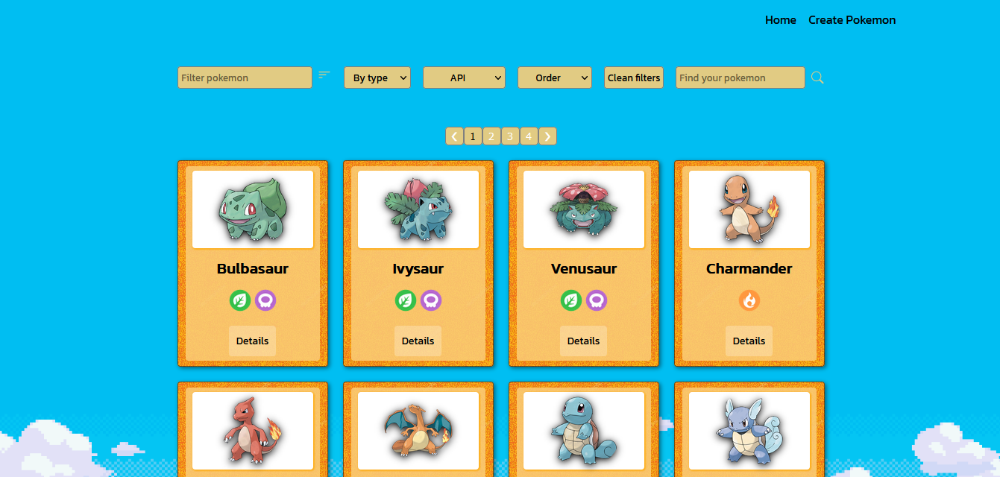

Desarrollo de una página web utilizando React para el FrontEnd y Redux como state management. Todos los componentes fueron desarrollados con CSS sin uso de librerías externas.  
La página consume datos de una API (“pokeapi”) a través de un Back End desarrollado en Node.JS utilizando Express, agregando nuevas funcionalidades a la API original.  
Algunos features del proyecto: Cache de búsquedas, ordenamientos y filtros, formulario controlado para creación de nuevos pokemons, etc.

# Como correr el proyecto de manera local

### Conectar la base de datos

 - Ve a tu gestor de bases de datos postgres y crea una nueva base de datos llamada `pokemon`, este es el nombre de la base de datos a la que nos conectaremos.
 - Crear un archivo .env dentro de la carpeta `api` y dentro de este poner el usuario y contraseña de postgres y tambien el nombre del host, de esta manera:
    - DB_USER=(usuario de postgres)
    - DB_PASSWORD=(pass de postgres)
    - DB_HOST=localhost
     
### _Instalar el paquete necesario para ejecutar la aplicacion_

- Abrir la terminal
    + Dentro de la carpeta `api`, ejecuta `npm install`
    + Dentro de la carpeta `client`, ejecuta `npm install` 

### _Correr el proyecto_

- Abrir la terminal
    + Dentro de la carpeta `api`, ejecuta `npm run start`
    + Dentro de la carpeta `client`, ejecuta `npm run start` (listo, ahora podes ir a http://localhost:3000/ y ver la aplicacion funcionando)

<!-- # Link al proyecto

# <a target='_blank' href=''>Click aqui</a> -->

# Fotos del proyecto

